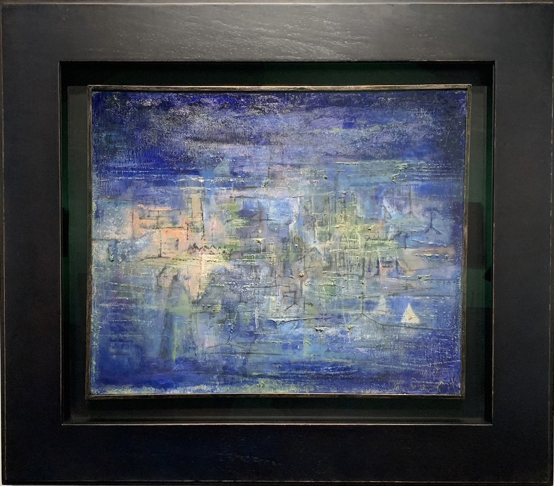
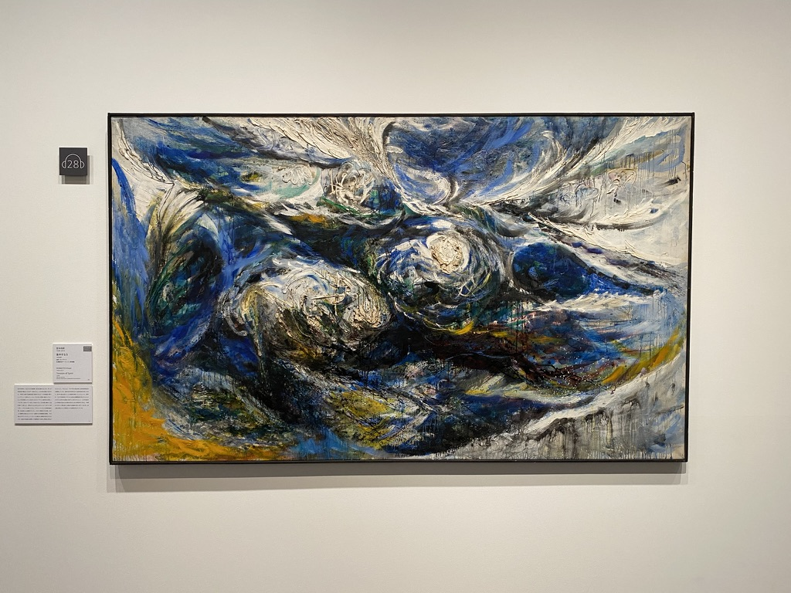
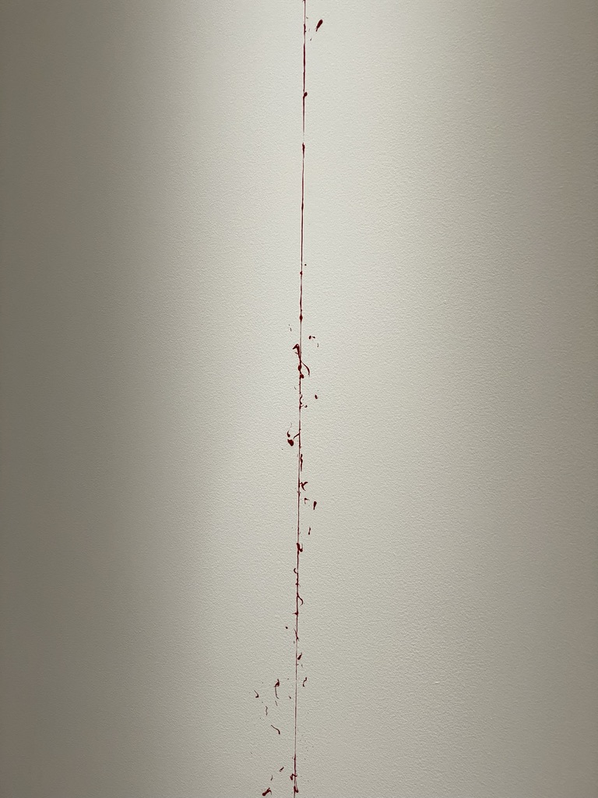

会期が終わってしばらく経ちますが、気に入った絵についてのメモをここに残しておきます。

## フォーヴィスムとキュビスム

- アンリ・マティス『画室の裸婦』：点描（スーラに師事）時代の作品と思われる。
- アンドレ・ドラン『女の頭部』：ドランはモローの弟子であり、同輩のマティスとともに「フォーヴ」と呼ばれるきっかけとなった展覧会に出品する。

- ジャン・メッツァンジェ『キュビスム的風景』

## 抽象絵画の覚醒

- ロベール・ドローネー『リズム螺旋』：ホドラーのリズム性を感じる。ホドラーの画面の構築的性格は抽象絵画に接続しうるのではないか。
- フランティセック・クプカ『灰色と金色の展開』
- フランシス・ピカビア『アニメーション』：時間の芸術である音楽を絵画で表現しようとしたカンディンスキーを補助線として引けるだろう。本作はフィルムを用いたアニメーション技法の黎明期である1914年に描かれた。映画が持つ「時間の芸術」としての一面を絵画で表現しようとする試みかもしれない。

- フェルナン・レジェ『抽象的コンポジション』：こういう境界がはっきりした幾何学的作品が好きになりがち。
- ホアキン・トレス＝ガルシア『宇宙の要素と自然界』：パイオニアの金属板、ボイジャーのゴールデンレコードの思想的先達と言えよう。
- ヴァシリー・カンディンスキー『三本の菩薩樹』：スタイルの源泉に点描があることがうかがえる、「手抜き点描」とも言える風景画。マティスにも同様の「手抜き点描」による作例が見られ、師匠筋であるスーラは浮かばれない。

- ヴァシリー・カンディンスキー『自らが輝く』：音楽的。対角線を強調した構図は、この時期の画家に顕著なスタイルである（解説より）。

- パウル・クレー『島』：[[ブリジストン美術館展@道立近代美術館]]でも見た一枚。当時は視覚情報から音楽を認識させる試みとして受容した。具象を描くスタイルとして考案された点描を、単にスタイルとして抽出したように思え、またしてもスーラが浮かばれない。もしくは、線で象られた島の外側に青色の点が多く配置されていることから、海を点描で表現している可能性もある。
- ラースロー・モホイ＝ナジ『W Sil』：放射線・霧箱実験を想起させる。この作品が成立したのは1931年。ブラケットが23,000枚の霧箱写真を撮影したのは1922年のことだった。
- ネイサン・ラーナー『モホイへのオマージュ』：ラーナーはモホイ＝ナジ（ハンガリー出身）の弟子であり、アメリカにおけるバウハウス運動の中心となった画家。
- ハンス・リヒター『色のオーケストレーション』
- ピート・モンドリアン『コンポジション（プラスとマイナスのための習作）』：直線の下書き箇所や、直線を消した修正跡が見られ、画家が正しい形を模索した過程がうかがえる。

便利なダイアグラムがあった。

## 熱い抽象と叙情的抽象

絵具の物質感、筆致の荒々しさにフォーカスするスタイル。

- ジャン・フォートリエ『旋回する線』
- アンス・アルトゥング『T1952-50』
- ピエール・スーラージュ『絵画 1969/5/26』

- マリア＝エレナ・ヴィエラ・ダ・シルヴァ『入口、1961』

- ザオ・ウーキー『水に沈んだ都市』『無題』『13.10.59』

- 堂本尚郎『作品』『集中する力』：日本画家を輩出する家系に生まれ、同じく日本画で名を成したが、その後渡仏して油彩に傾倒した。

## 抽象表現主義

アメリカにおけるアクション・ペインティングの勃興。WWIIで亡命した欧州の画家たちがそのきっかけとなった。

- ソーニャ・セクラ『無題』：平面的なスタイルだが、奥行きを感じる。この奥行きの原因は各々の抽象要素に具象（青空のもと奥へ伸びる道、バス停、車など）を感じたためか。
- クリフォード・スティル『1955-D』：赤一色の画面だが、画面中央に縦に走るひび割れが、左右の赤の拮抗による緊張をもたらす（解説より）。赤一色の画面が、この一筋のひび割れを強調し、本題を浮き彫りにする。
- アド・ラインハート『抽象絵画』：黒一色の画面。『4:33』を思わせる。本作が成立したのは1958年。4:33が作曲されたのは1952年。
- ヘレン・フランケンサーラー『ベンディングブルー』：モワッとした質感のピンクの背景と、中央に描かれる筆致の激しさ・強弱との対比によって、画面の奥行きを感じさせる。
- ジャスパー・ジョーンズ『薄雪』：蜜蝋による作。

## 戦後日本の抽象絵画の展開

- 猪熊弦一郎『都市計画（黄色 No.1）』

- 瑛九『黄色いかげ』：点描。画家は本作以前に、丸い形状（＝これ自体が具象）によって画面を覆うスタイルの作品を制作してきたらしい。本作の点描は点で具象を表現しているように思われ、抽象と具象の対応関係が変化しているのかもしれない（過去作を要確認）。

## 具体美術協会

アクション・ペインティングの日本における展開。

- 金山明『March 7』：ポロックがこってりだとすると、本作はあっさり風味でダシ感がある。こっちのほうが個人的に好み。
- 上前智祐『作品』

## 巨匠のその後

- アンス・アルトゥング『T1988-R9』
- アンス・アルトゥング『T1989-H35』：白地はカンバスまま。

- ザオ・ウーキー『24.12.95』：平たい塗り（淡いピンク）の上に飛沫と激しい筆致。左右両側からの水墨調の水流が、中央でぶつかりほとばしる。
- ザオ・ウーキー『18.13.2008』：本作を見ても、抽象的なスタイルで具象を描く作家であると感じる。
- ザオ・ウーキー『07.06.85』

## 現代の作家たち

- 鍵岡リグレ アンヌ『Reflection h-30』：はじめに色の層（アクリル）を重ね、後に削って形と色彩を掘りおこしているらしい。「熱い抽象」を想起させるが、ここまでくると彫刻的である。

- 婁正綱（ろうせいこう）『Untitled』：相模灘。スタイルの序列として書と画を同列かつ同時に実践する作家はめずらしい（解説より）。

- 横溝美由紀『crossing P150.079.2023-five elements』：あっさり感、ダシ感があって好き。

- 横溝美由紀『the line』：美術館の壁に直接描いている。これは"やってる"でしょ。

