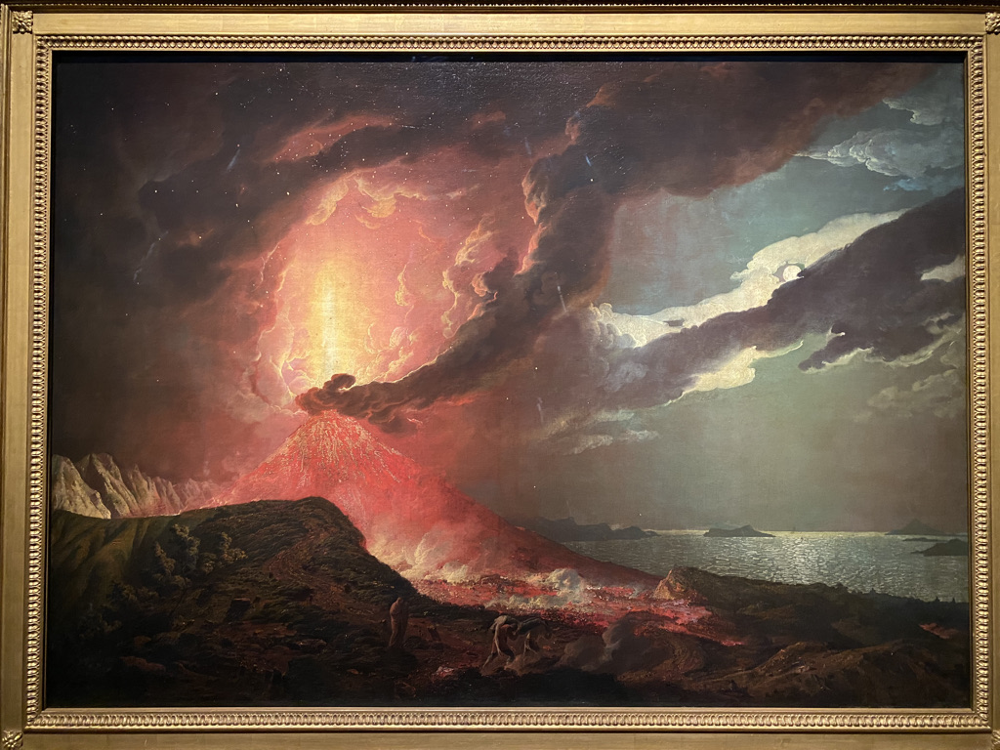
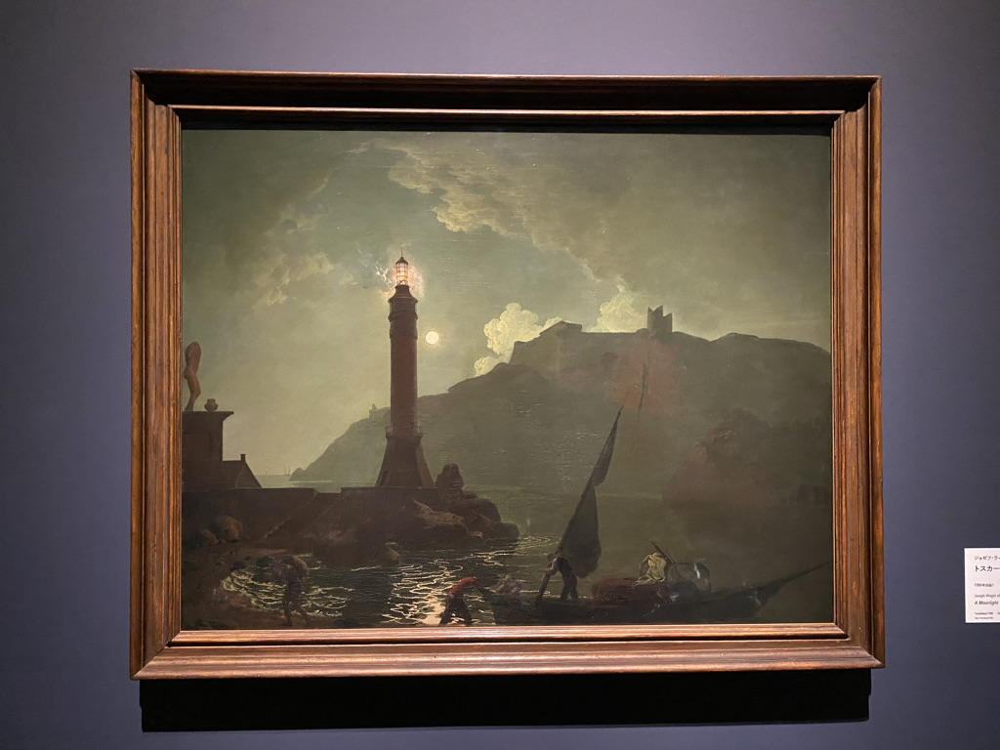
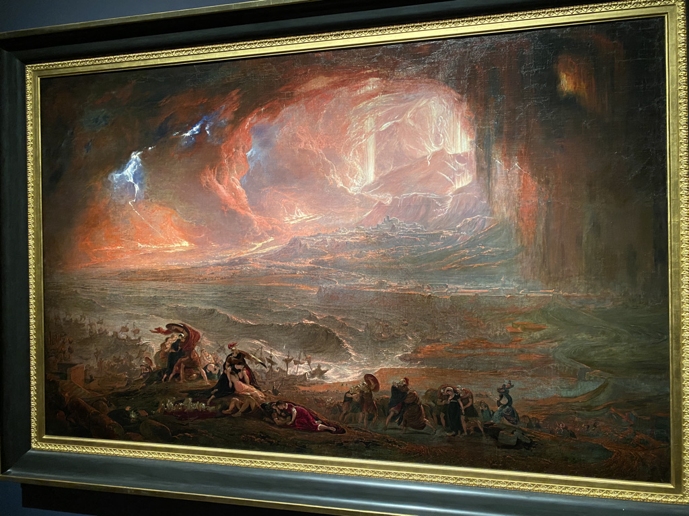
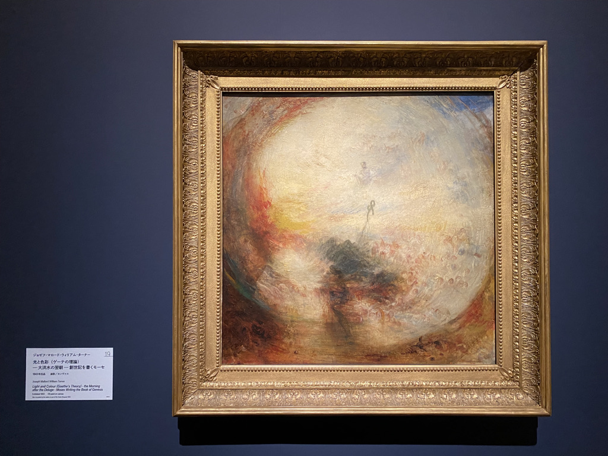
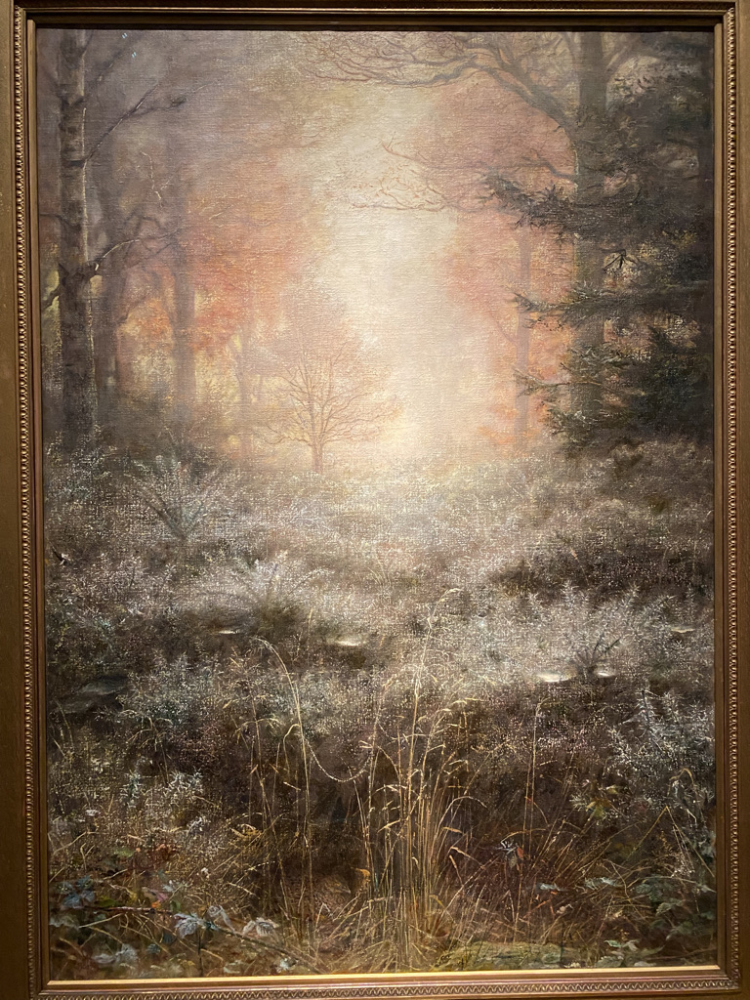
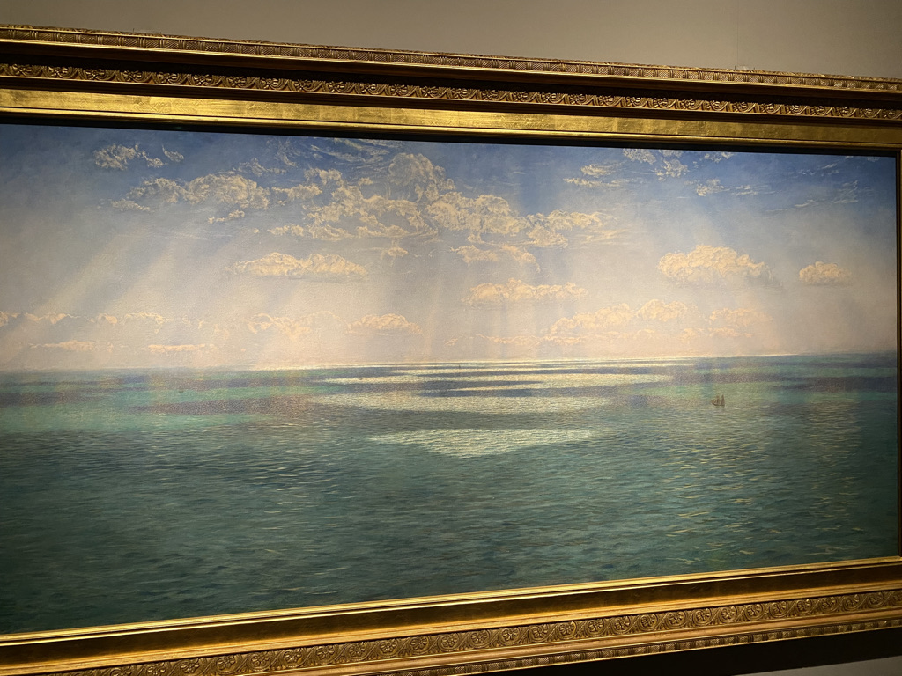
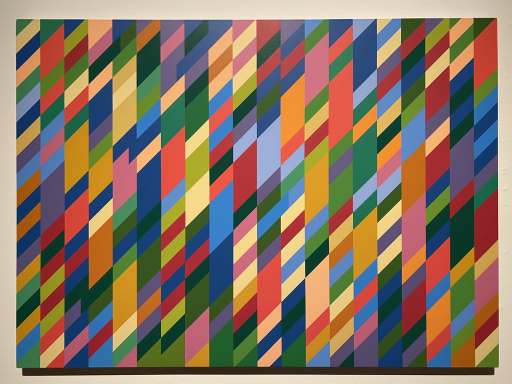
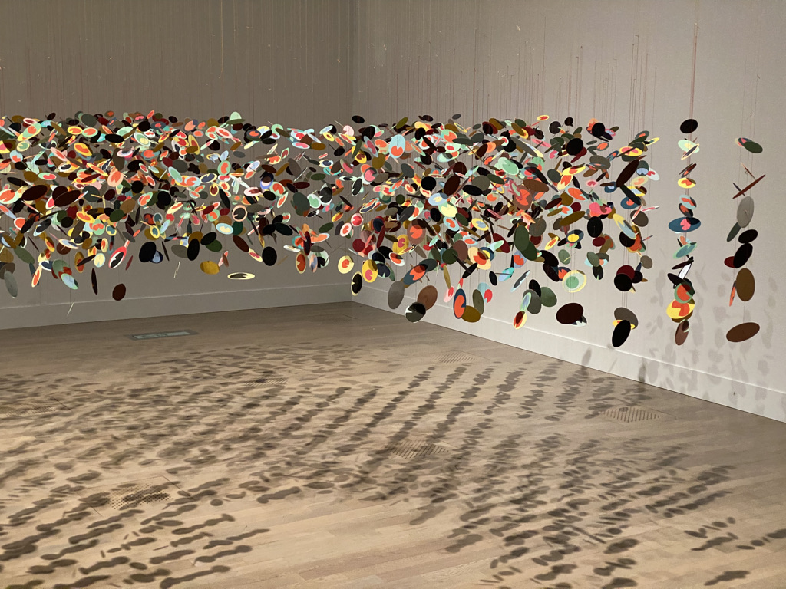
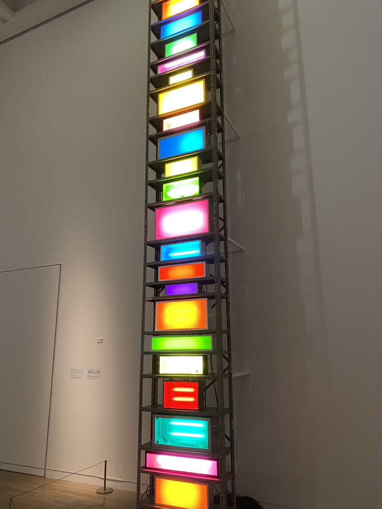
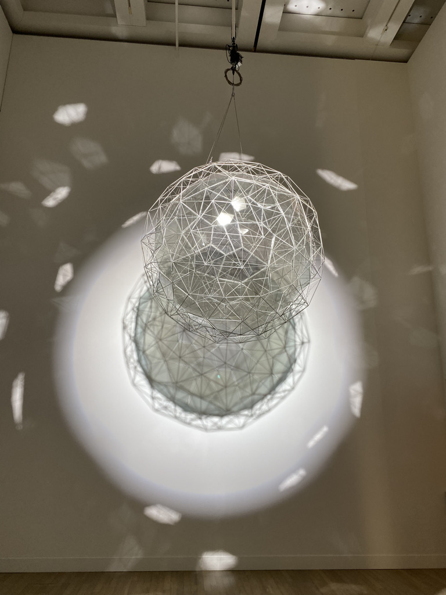

例によって美術展に行ったので気に入った絵についてメモを残す。

## Room 1

18世紀末〜19世紀前半

- ジョゼフ・ライト・オブ・ダービー『噴火するヴェスヴィオ山とナポリ湾の島々を臨む眺め』：画面左側の猛々しい赤と、画面右側の静謐な青の対比。しずかに舞い落ちる火の粉、雲の合間の月、海の静けさがかえって際立つ。

- ジョゼフ・ライト・オブ・ダービー『トスカーナの海岸の灯台と月光』：光と闇の表現が素晴らしい。フェルメールを始めとする15世紀オランダ絵画における光と影の表現を思い出させる。画面中央の灯台の光がじわじわと漏れ出す表現と、そこから画面手前に向かって光が導かれ水面に波波と反射する光の表現は白眉。

- ウィリアム・ブレイク『アダムをさばく神』：ロマン派絵画の走りといえる（解説より）
- ジョン・マーティン『ポンペイとヘルクラネウムの崩壊』：噴火する火山、押し寄せる火砕流、都市の崩壊と人々の絶望。壮大な絵画だ。落雷が表現されており、科学考証が見られる。

- ジョゼフ・マロード・ウィリアム・ターナー『色と色彩（ゲーテの理論）――大洪水の翌朝――創世記を書くモーセ』：光と闇、暖色と寒色の対立が相対する感情を表している（解説より）

## Room 2

19世紀後半

- ジョン・エヴァレット・ミレイ『露に濡れたハリエニシダ』：ラファエル前派を代表する画家の晩年の作。ターナーのように淡い光の表現。

- ジョン・ブレット『ドーセットシャーの崖から見るイギリス海峡』：光の表現にラファエル前派の影響が見られるという（解説より）。大画面に浮かぶ雲と、そこから漏れ出る光柱の表現は白眉。

## Room 3

- ウィリアム・ローゼンスタイン『母と子』

## Room 4

- モホイ＝ナジ・ラースロー『K VII』：四角形のオブジェクトの重なりに光の透過を感じさせる色彩。画面右上を中心に放射状の下書き線がかろうじて見られ、各四角形の角が線上に乗っていることが見て取れる。黄金律か。

## Room 5

- バーネット・ニューマン『アダム』：血、リンゴの赤
- ブリジット・ライリー『ナタラージャ』

- ペー・ホワイト『ぶら下がったかけら』：一つ一つのかけらはカートゥーンの目のように見える。あるいはカラフルな花壇。目は花にも通じる（花に見られている感覚＝植物恐怖症）。

## Room 6

- キャサリン・ヤース『廊下』：写真のネガとポジのツギハギ、重ね合わせ。
- ジュリアン・オピー『雨、足音、サイレン』：色の境界にエッヂを感じる。
- ジェームズ・タレル『レイマー、ブルー』：壁の後ろから青い光が放射されて、部屋の奥、中央に壁が浮かんでいるかのように見えます。光を表現の手段として用いた作品についてタレルは、次のように述べています。「私の作品には対象もなく、イメージもなく、商店もありません。対象もイメージも商店もないのに、あなたは何を見ているのでしょうか。見ている自分自身を見ているのです」。本作品は、タレルのパイロットとしての経験からインスピレーションを得たものと言われています（解説より）。光のぼんやりとした淡さと、中央の壁のブロックのエッヂの効いた質感との対比が気持ちよい。
- デイヴィッド・バチェラー『ブリック・レーンのスペクトル2』

## Room 7

- オラファー・エリアソン『星くずの素粒子』

