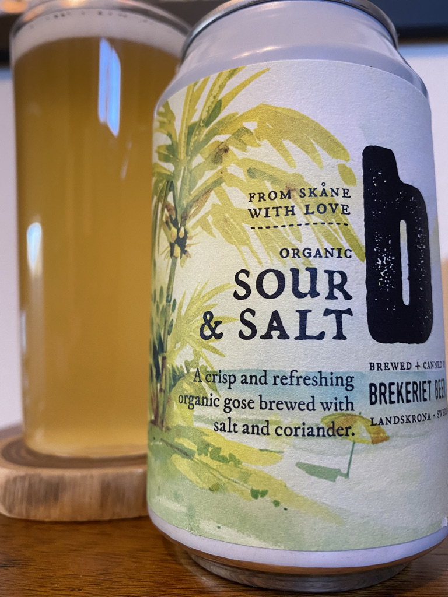
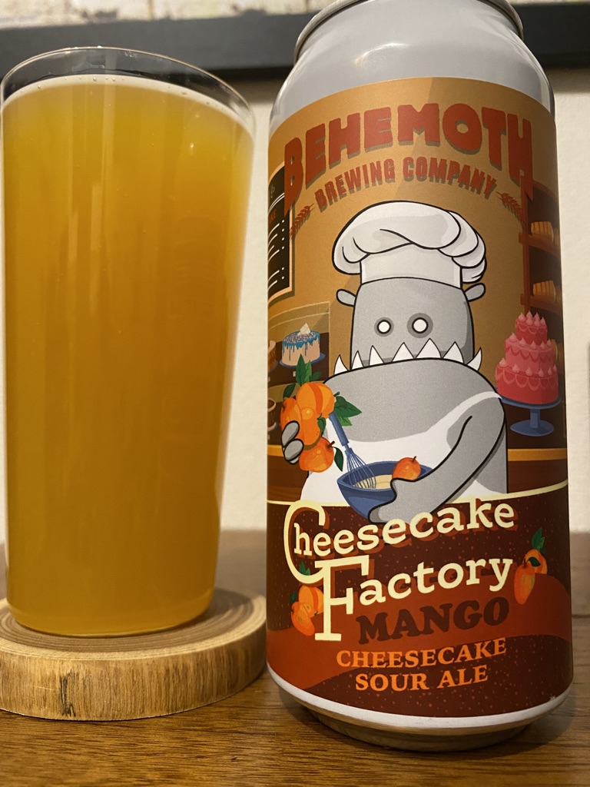
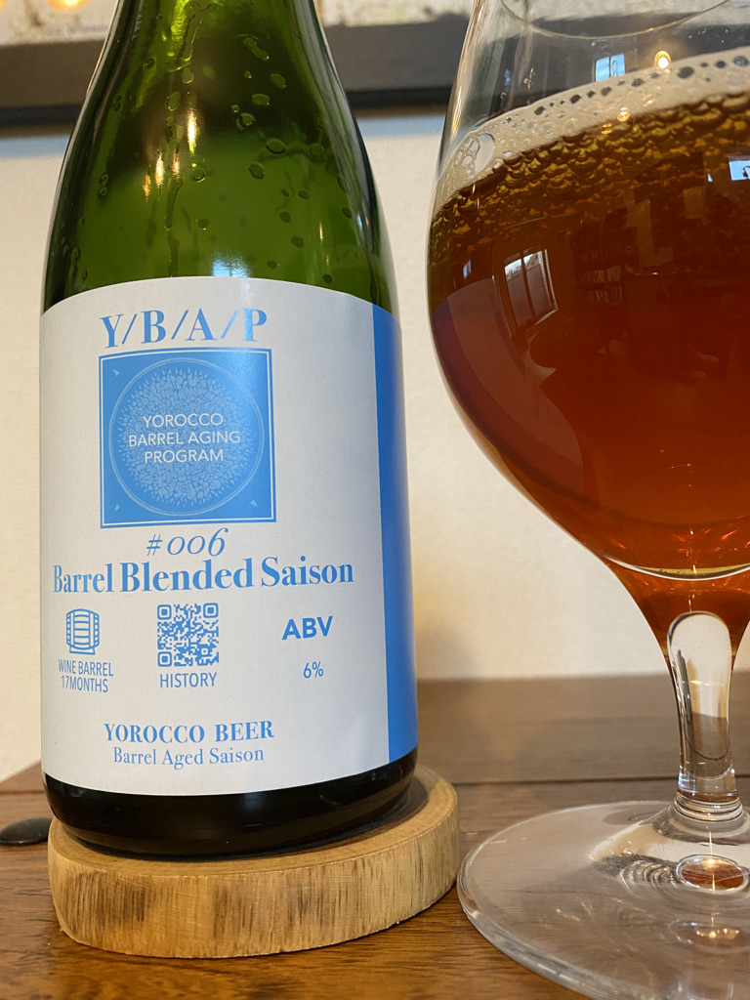
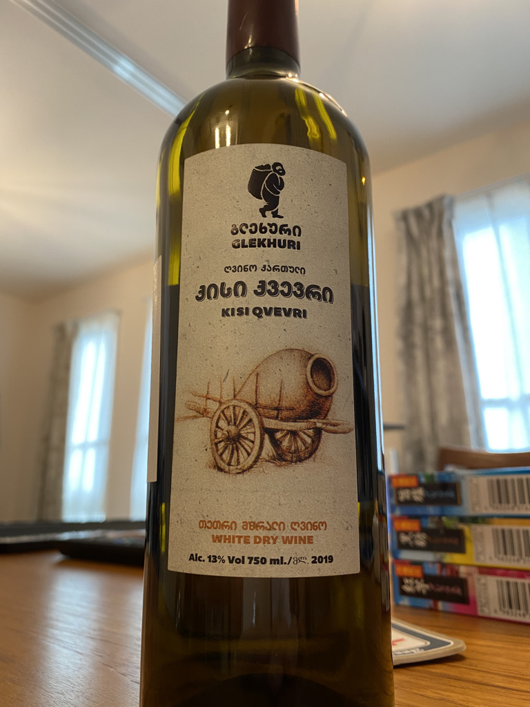
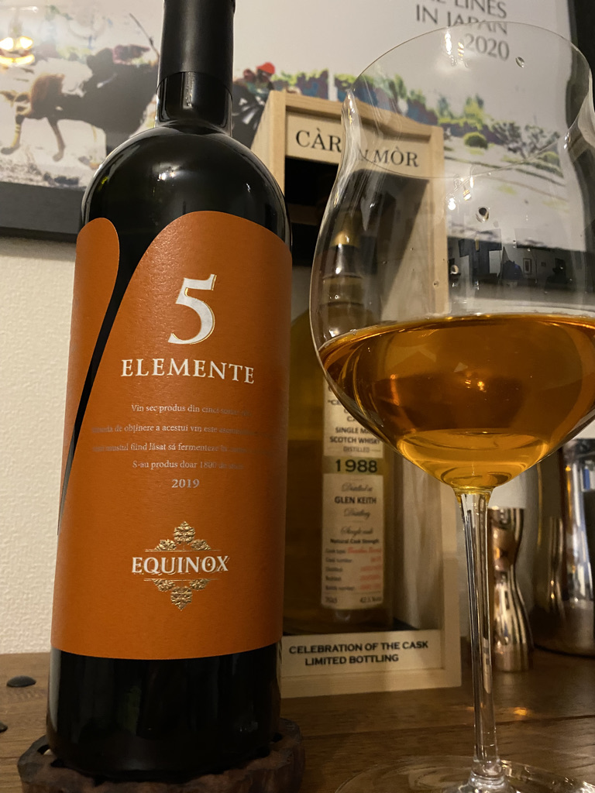
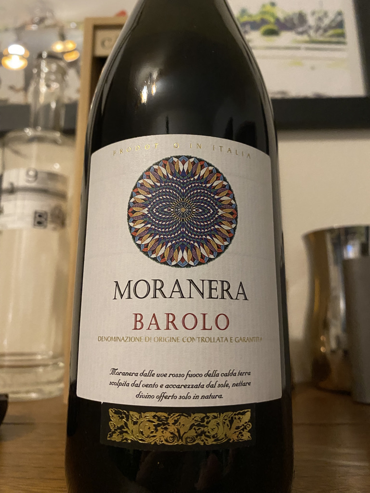
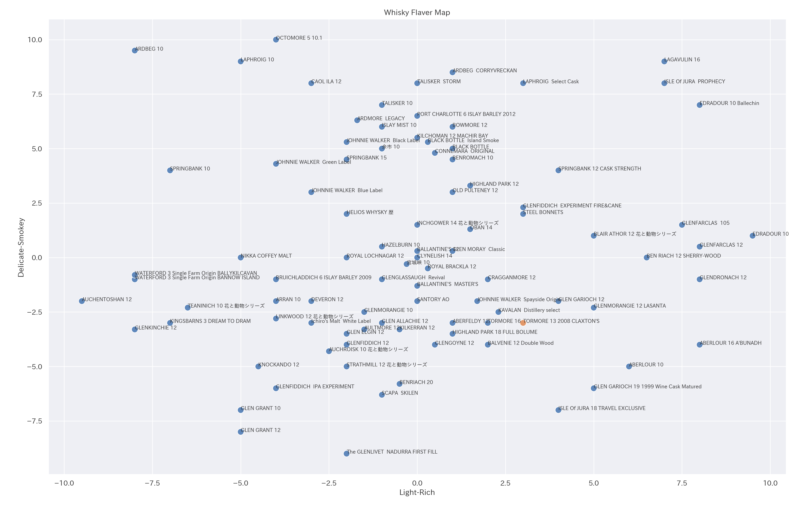
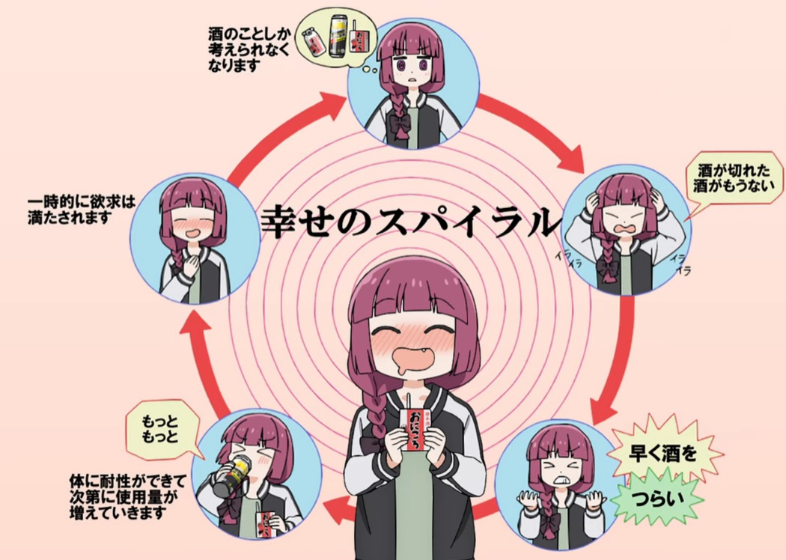

> 本記事は文芸同人・ねじれ双角錐群による[アドベントカレンダー企画](https://nejiresoukakusuigun.tumblr.com/post/702237271479533568/%E3%81%AD%E7%BE%A4%E3%82%A2%E3%83%89%E3%83%99%E3%83%B3%E3%83%88%E3%82%AB%E3%83%AC%E3%83%B3%E3%83%80%E3%83%BC2022)に参加しています。

Liquor of the Year 2022ということで、この記事では今年飲んでおいしかったビール、テーブルワイン、ウイスキーをまとめていきます。力尽き膝折れたとき、最後に人生を駆動してくれるのは肝臓燃焼動力です。肝臓を捧げよ。

## ビールの部

> ショウジョウバエの成虫は、繁殖を邪魔されるとエタノールに惹かれやすくなる。もしや悲しみを紛らわせてでもいるのだろうか。
> —— ロブ・デサール＆イアン・タッターソル『ビールの自然史』

### Sour & Salt（BREKERIET）

Brekerietは2012年スウェーデンに設立されたサワーエールとワイルドエールに特化したブリュワリーで、醸造所近辺周辺で採取した野生酵母と菌からすべてのビールを醸造しているらしい。
彼らが放つゴーゼスタイルのサワーエール：Sour & Saltはジャケ買いを誘う一本。そのヴィジュアルに違わず、一口飲むと醸造時に投入された大量の塩とコリアンダーによる爽やかな酸味が一陣の淡い潮風となって全身を駆け抜ける！　そして訪れる菌発酵由来のイースト香のやさしい余韻に誘われ、次の一口が止まらない。最高の夏ビールは、たった一本で夏を現出させるものだ。

### Cheesecake Factory Mango（Behemoth）

チーズケーキファクトリーマンゴーって流石になんだよ。
カテゴリ上は先のSour & Saltと同じサワーエールであるが、中身はまったくちがう。こちらは醸造過程で大量のバニラの実、クラッカー、マンゴーを投入し、ボディをラクトースで補ったペストリースタイルのエールだ。名前にそぐわず、強烈なチーズケーキのアロマと、濃縮還元マンゴーの暴力的な味わいは一度飲んだだけで脳にこびりついて離れない！　それでいて余韻は意外にもさっぱりしており、鼻からかすかに抜けるバニラ香の上品さがニクい一本だ。

### Y/B/A/P（ヨロッコビール）

鎌倉のブリュワリー：ヨロッコビール。少数生産で知られ、限られた酒屋やビアバーでのみお目にかかれるちょっぴりレアなブリュワリーだ。そのヨロッコビールがさらに本数を絞って生産したY/B/A/Pは、3本の赤ワイン樽それぞれに異なる野生酵母を投入し、5ヶ月間熟成させることで作られた変わり種セゾンだ。ボトリング後に瓶内発酵・熟成が進む一本で、購入後に自宅で熟成させることも可能だが、買ったビールはその日のうちに口にすることを信条とするわたしは当然のごとくすぐに飲んでしまった。
彩度のあるアンバーカラーが宝石のように美しい。注いですぐ香木のようなかすかな香り。口に含むと芳醇な秋の果実、ドライフルーツのような甘みが広がる。後味にトロピカルフルーツ感とスムーズな酸味の余韻。温度が変わるごとに表情を変える奥深い面を持つ。
理想としては、半年ごとに一本ずつ開けて味の変化を楽しみたいところ。また同じコンセプトのボトルが出るようなら、ぜひ何本か確保しておきたい一本だ。

## テーブルワインの部

ぼくの大学生時代はセイコーマートとは切っても切り離せない。
バイト代を毎月とらのあなやらしんばんで使い果たしていたぼくは、堅あげポテト、焼きそば弁当、ドラフトギネスなどといった重要物資をつねに地域最安値で提供するこの北海道ローカルコンビニチェーンによって生かされていたのだ。中でもとりわけぼくの人生を救ってくれたのは500円ワインだった。酒卸業者により創始されたセイコーマートは独自の流通網によってフランス・イタリア・チリの高品質テーブルワインを考えられないほどの廉価で販売し、それはひとりの青年の日々に極彩色の彩りを添えたのである。
あの日々から10年。北海道を離れた今セイコーマート品質のテーブルワインが500円で手に入ることはなく、明日の昼食代に悩むほど逼迫した懐事情とも無縁になり、この肝臓はワインを毎日飲むことを拒みつつあり、日本円はずいぶんと安くなった。そういうわけで今日、我が家のテーブルワインの価格帯は3000円台になろうとしている。ずいぶん遠いところまでやってきたらしい。

### Kisi Qvevri 2019（Teliani Valley）

ジョージア アンバーワイン（オレンジワイン）
キシ100%
辛口

2022年は世界がオレンジワインを発見した年だった。白ブドウを使って赤ワインのように造るオレンジワインは、白ワインらしいトロピカルフルーツや柑橘類の軽快なアロマと、赤ワインらしいタンニンを併せ持つ、ワイン界のニュー・スタンダードだ。
オレンジワインの本場ジョージアからやってきたテリアニ・ヴァレーのキシ・クヴェヴリは、貴腐ワインを思わせるマスカットやピーチの甘い香りが印象深い一本。極めてスイートなアロマとたしかなタンニンの味わいが調和したオレンジワインのお手本のような一本であり、次の一口が無限に押し寄せあっという間に空になってしまう危険なボトルでもある。

### 5 ELEMENTE 2019（EQUINOX）

モルドバ オレンジワイン
シャルドネ45%、フェテアスカアルバ30%、フェテアスカレガーラ15%、バベアスカグリ5%、ピノグリ5%
辛口、亜硫酸塩無添加

こちらもオレンジワイン。聞き覚えのないブドウ品種が並んでいる。5種のうち3種はモルドバの土着品種らしい。
アプリコットティー（ダージリンっぽい）の華やかなアロマと、シャープな酸味＆タンニンの味わいが同居している。明るい香りとダークな味わいのギャップが楽しい一本。辛口でどんな料理にも合う。個人的にはパック寿司のお供にオススメ。

### BAROLO 2016（MORANERA）

イタリア 赤ワイン
ネッピオーロ100%
辛口、ミディアムボディ

テーブルワインの本質は瞬発力にある。開封したその瞬間から飲者の期待に答えることを義務付けられたボトルがまとう悲壮感、それこそがテーブルワインの本懐だ。彼らは買われたその日のうちに飲み干される運命から決して逃れられないのである。
「王のワインでありワインの王」と呼ばれるバローロはイタリアワインを象徴する銘柄であり、長期熟成でポテンシャルを開花させる印象が強い。しかし、BAROLO 2016 MORANERAに関しては、少々ちがった一面を持つ。このボトルは、言うなればマカロニウエスタンだ。つまりは、早飲み《ファストドロウ》である。
口にするやいなや、煉瓦を思わせる暗く乾いたルビー色の弾丸による樽由来のバニラ香が脳天を撃ち抜く。炸裂した弾頭がプラムとカシスの凝縮した果実香を振りまき、穏やかな酸味とほどよいタンニンがその中心を駆け抜けていく。そして、それらが流れ去ったのちに浮上するドライレーズンの静かな流れ——なんという鮮烈さとバランス感覚だろう。
2016年は近年におけるバローロの当たり年らしい。その一本を3000円台で手に入れられたことは僥倖というほかあるまい。

## ウイスキーの部

### # GLENTURRET 29 1988 SIGNATORY

爽やかな気付け酒、開封後しばらくしてから妙なる香が立ち始めた。

1988/6/23蒸留−2018/3/13瓶詰：29年熟成のグレンタレットで、筆者よりも年上のボトルになる。バーボンホグスヘッドによる熟成で、年数の割に色合いは薄く、飲み口も爽やか。ただし、めちゃくちゃデリケートな一本。
開栓してすぐのころは、ティーニニック10年（花と動物シリーズ）のような、爽やかな気付け酒の印象を持っていたが、開栓して数ヶ月経ったころから、古い香木のような妙なる香が立ち始めてきた。今あらためて嗅いでみるとキンモクセイとかヨモギとか青い梅のような和風の香りが感じられる。キンモクセイの匂いがするウイスキーって何？　ハイボールにすると（29年熟成ボトルをハイボールにするな）キンモクセイと梅のアロマがめちゃくちゃ立ち上ってきて興奮してしまう。
こういう謎めいたボトルに出会えると、ウイスキーが好きでよかったなと思える。
グレンタレットはスコットランドに現存する最古の蒸留所（1775年創業）。1923年から59年まで閉鎖されていたが、あるひとりの狂信的なウイスキー愛好家：ジェームズ・フェアリーによって再建され、今日においてもマッシュタンを人力（木の棒）でかき混ぜるなど原始的な方法で酒造を続けているという。

## テイスティング

 - ボディ：ミディアムライト
 - 色：ペールゴールド
 - 香り：レモンとキウイフルーツのハーブ漬け、シナモン、ニッキ
 - 味わい：ビター＆スパイシー、フレッシュな梅とミントや香草の苦み、きわめてドライ
 - 余韻：ショート、ビターネスとともにかすかな梅の残り香、春または秋のようにあっという間に過ぎ去ってゆく

## オススメ

こういう人にオススメ：
オススメの飲み方：ストレート、加水でマイルドに、もったいないけどハイボールでキンモクセイのアロマと梅の風味
オススメのつまみ：nan
次の一本：nan

### # TORMORE 13  2008 CLAXTON’S Warehouse No.1

ラム樽熟成の個性が光る一本。クレームブリュレの殻に包まれた完熟メロンのアロマ、オイリーな舌触りから甘苦いチョコレートの味わいとほのかな木香、フィニッシュにむせるほど熱いバーボン香と塩キャラメルの余韻を残す。ハイボールも絶品だ。

## ストーリー

> "すべてのウイスキー蒸留所の中で、建築学的にもっともエレガントな蒸留所がこのトーモアである。音楽を奏でる時計、鐘楼、周囲を植物で飾られた庭園風な池と、まるで山の水を利用して治療もできる温泉保養地のような風情である。”
——マイケル・ジャクソン『モルトウィスキー・コンパニオン改訂版』

1960年代にトーモア、タムナヴーリン、トミントールといった蒸留所が相次いでスペイサイドに設立されたことは、アメリカにおけるスコッチ需要の高まりに対する回答だった。これらの蒸留所ではアメリカ需要に対応するため、創業以来ライトな原酒造りが続いており、熟成樽の個性をよく引き出す。面白い樽で熟成されたボトラーズボトルを見つけたなら、積極的に飲んでおきたい。

## テイスティング

- ボディ：ミディアムリッチ
- 色：太陽のようなゴールド
- アロマ：完熟メロン。クレームブリュレの殻。
- 味わい：オイリー。濃密な甘みとほどよい苦みが黒いチョコレートを思わせる。口中に爆発するバニラ香。
- 余韻：まろやか。むせるほど熱いバーボン香が心地よい。塩キャラメルの余韻。

フレーバーマップ上では、スペイサイドモルトの中でもバーボン樽熟成とシェリー樽熟成の間くらいに位置するイメージ。フルーティでスパイシー、まろやか。

## オススメ

- こういう人にオススメ：トロピカルフルーツ感のあるウイスキーが好きな人。グレンモーレンジィ ラサンタが好きな人。
- オススメの飲み方：気付け。ストレート。ハイボールもうまい。
- オススメのつまみ：ナッツ、ケーキなどの洋菓子。何にでも向く。
- 次の一本：ブレア・アソール12年（花と動物シリーズ）

### # GLENDULLAN 20 1999 Lady of the Glen

華やかな香水を思わせるスリムで女性的な一本。

グレンダランはオールドパーのキーモルトで、シングルモルトとしてのリリースは珍しい。
とてもデリケートで、香水っぽい一本。飲む時間帯や体調によってけっこう印象が変わる。今年はこういうデリケートなタイプのウイスキーを多く飲んだ一年だった。

## テイスティング

 - ボディ：ライト
 - 色：イエローゴールド
 - 香り：青リンゴ、バニラ、タンジェリン、モルティ、ヘザー、オーク、若干の土っぽさ
 - 味わい：桃や花蜜を思わせる上品さと軽やかさ、青草や未熟なタンジェリンのほろ苦さが調和する
 - 余韻：穏やかな花の香りが長く続き、香水を思わせる、バイオレットフィズ

## オススメ

こういう人にオススメ：
オススメの飲み方：ストレート
オススメのつまみ：nan
次の一本：nan

### # INCHGOWER 20 2000 The maltman

> "スペイサイドモルトと言うよりも海辺のモルトのような味がする。蒸留所は、バッキーという漁村の近くの海岸にあるが、そこはスペイ川の河口からそれほど遠いところではないので、両方の個性を兼ね備えているのだ。"
> — マイケル・ジャクソン『モルトウィスキー・コンパニオン改訂版』

モルトマンは、スコットランドのボトラー：メドウサイド・ブレンディングによる旗艦ブランドであり、シェリーカスクのセレクションが特に優れていることで知られる。原酒のインチガワーは主要ブレンデッドへの供給が多いためボトラーへの流通が少ない上に、珍しいダークシェリーである
（入手しやすい花と動物シリーズのボトルはバーボン樽熟成）ということで食指が動いた一本。
テイスティングノートの通りかなりの個性派で、どことなく紹興酒っぽい雰囲気があるため、シェリー樽熟成でありながら中華料理にも合うという変わり種。一家の酒棚ラインナップに一本忍ばせておけば、ウイスキーライフの幅が広がります。
このボトルは、日本が誇るウイスキーリテラー：信濃屋によるセレクション。毎週のように最寄りの信濃屋に通っているヘビーユーザーなので、ボトリング業界への進出を応援したい。

## テイスティング

 - ボディ：リッチ
 - 色：赤茶けた、ダークなメープルシロップ
 - 香り：ツンとした紹興酒、山の幸の出汁、醤油、黒糖、アタック感強め、加水でドライオレンジ
 - 味わい：ドライ、ピリッと辛い、ブラッドオレンジの皮の渋み
 - 余韻：意外と淡泊、岩塩と黒糖の混合物、ヒリついた熱さが穏やかに去っていく

## オススメ

こういう人にオススメ：
オススメの飲み方：ストレート
オススメのつまみ：nan
次の一本：nan

---

以上、LOTY 2022でした。
みなさんもお気に入りのテーブルワインを見つけて幸せのスパイラルを実現しましょう！

来年もおいしいお酒に出会えますように。
